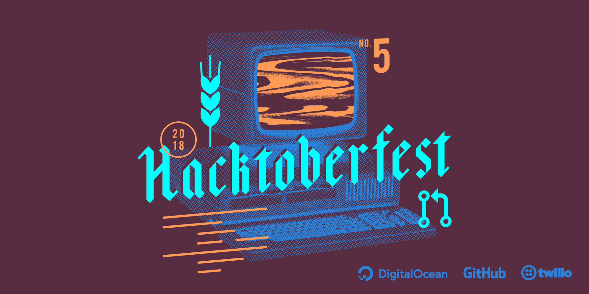

# Hacktoberfest in Aba


This repository houses the codebase for the Hacktoberfest in Aba website hosted on GitHub Pages. The live version can be accessed [here](https://HacktoberfestinAba.github.io). More about GitHub Pages: https://pages.github.com/.

## 💡 What Is Hacktoberfest

Hacktoberfest — brought to you by DigitalOcean in partnership with GitHub and Twilio — is a month-long celebration of open source software. Maintainers are invited to guide would-be contributors towards resolving issues that will help move the project forward, and contributors get the opportunity to give back to both projects they like, and ones they've just discovered. No contribution is too small — bug fixes and documentation updates are valid ways of participating.

Celebrated every month of October based on the German festivity Oktoberfest. The main purpose of this event is to stimulate open source contributions on Github by rewarding users that participate in making at least 5 Pull Requests with a T-Shirt.

### 😄 Participation Details

Hacktoberfest is open to everyone in our global community. Whether you’re a seasoned contributor or looking for projects to contribute to for the first time, you’re welcome to participate.
Pull requests can be made in any GitHub-hosted repositories/projects. As long as the project is public and GitHub-hosted, your PRs will count towards your participation.
You can sign up anytime between October 1 and October 31. Just be sure to sign up on the official Hacktoberfest website for your PRs to count.

### ❇️❇️❇️ Participation Rules

To get a shirt, you must make five pull requests (PRs) between October 1st–31st in any timezone. PRs can be to any public repo on GitHub, not just the ones highlighted. The PR must contain commits you made yourself. PRs reported by maintainers as spam or that are automated will be marked as invalid and won’t count towards the shirt. This year, the first 50,000 of you can earn a T-shirt (compared with 30,000 in 2017).

* Create an account on GitHub: [Github](https://github.com);
* Follow the event to account for each of the contributions: [Hacktoberfest](https://hacktoberfest.digitalocean.com/);
* You need to know how Git works: [GitHub](https://help.github.com/) , [Digital Ocean](https://www.digitalocean.com/community/tutorial_series/an-introduction-to-open-source) .

### Maintaining a repo?

Create issues or add to existing ones the label “Hacktoberfest” on your GitHub projects to help new contributors know what to work on. Tag any spam or irrelevant PRs with the "invalid" label to disqualify them.

### How do I track my progress?

Log in with your GitHub account at https://hacktoberfest.digitalocean.com/ to check your progress and stats.

### I completed 5 PRs. When will I receive my t-shirt?

We will start sending out emails with more details on redeeming t-shirts throughout the month. Stay tuned!

### How do I get stickers?

Stickers are included with your t-shirt, once you complete 5 PRs.

### What happens if I complete fewer than 5 PRs by the end of the month?

Unfortunately you will have to submit at least 5 PRs in order to get a T-shirt.

### 🏃🏃🏃 Completions

#Quality Standards
In line with Hacktoberfest value #2 (Quantity is fun, Quality is key). We have provided examples of the quality standards we encourage. This applies mainly to beginners.

- PRs that are automated e.g. scripted opening PRs to remove whitespace / optimize images.
- PRs that are disruptive e.g. taking someone else's branch/commits and making a PR.
- PRs that are regarded by a project maintainer as a hindrance vs. helping.

Something that's clearly an attempt to simply increase your PR by +1 to count for October.
Last but not least, one PR to fix a typo is fine. 5 PRs to remove a stray whitespace... not cool.

## 🕯 About

As a means of encouraging participation during Hacktoberfest 2018, this project targets those relatively new to the open source ecosystem and programming in general, but are eager to learn and improve their creative skills by contributing to projects on GitHub.

By creating issues that require easy to complete tasks, we are providing a platform where beginners can readily join the open source movement without being overwhelmed with the restrictions and complexities they may encounter when trying to contribute to already established open source projects. We hope that new contributors can steadily grow confident while gaining hands-on experience as they continue to contribute to projects like this.

Welcome to the world of Open Source.

## 📑 Getting Started

Aiming to be very beginner friendly and to advocate simplicity and clarity, these instructions will get you a copy of this project up and running on your local machine for development and testing purposes. See deployment for notes on how to deploy the project on a live system.
Fork this repository and get started.

## ⚠️ Rules

* Use Pull requests, do not commit to the Master branch or we risk running into conflicting commits.  
* Changes must be confirmed.
* Project maintainers will be in charge of monitoring issues, reviewing submitted patches and merging pull requests.
* Member contributors will be responsible for collaborating with external contributors to tackle project issues and submit patches via pull requests.
* Please update this readme as needed.

### Prerequisites

To work on this project from your local machine, you would need:
- Basic understanding of [Git](https://git-scm.com/) and the [GitHub Workflow](https://guides.github.com/introduction/flow/). 
- Also, experience with web technologies (HTML, CSS, JavaScript) is recommended but not necessary.
 -A Text Editor/Web IDE, and a recent version of any popular web browser.

## Installing

**Note:** *The dollar sign '$' represents input interface of Mac and Linux machines. Windows users may consider installing Git-Bash.*

On your local machine, navigate to the folder you want to hold your project.
```
$ cd /path-to-folder
```
Clone the forked repository from GitHub.
```
$ git clone https://github.com/<yourusername>/HacktoberfestinAba.github.io
```
Navigate into the cloned repository.
```
$ cd project
```
Create a new branch.
```
$ git branch dev-<yourusername>
```
Switch to your new branch.
```
$ git checkout dev-<yourusername>
```
Make the changes you want on your new branch and when you are done, you can verify the changes using `git status`.

To commit your changes,
first stage the files for commit.
```
$ git add <filename1> <filename2>
```
Verify that the files have been staged.
```
$ git status
```
Then make your commit.
```
$ git commit -m 'commit message'
```
To merge your modifications from the development branch, first switch to the `master` branch.
```
$ git checkout master
```
Merge the development branch with the `master` branch.
```
$ git merge dev-<yourusername>
```
Finally, push your changes to your GitHub repository.
```
$ git push origin master
```

## 📥 Deployment

This project doesn't require you running a live server on your local machine. Simply navigate to the project folder and open the `index.html` file to get started.

## Built With

* [HTML, CSS & Javascript](https://) - Web Technologies
* [Git](https://git-scm.com) - Version Control System

## ➕ Contributing

Please read [CONTRIBUTING.md](CONTRIBUTING.md) for details on our [code of conduct](CODE_OF_CONDUCT.md), and the process for submitting pull requests to us.

## Versioning

We use [Git](https://git-scm.com/) for versioning. For the versions available, see the [tags on this repository](https://github.com/HacktoberfestinAba/HacktoberfestinAba.github.io/tags).

## 📖 Authors

* David Onoh [davidconoh](https://github.com/davidconoh)
* Prosper Opara [kodekage](https://github.com/kodekage)

## ✔️ License

This project is licensed under the MIT License - see the [LICENSE](LICENSE) file for details.

## ✔️✔️✔️ Acknowledgments

* [DigitalOcean](http://digitalocean.com/)
* [GitHub](http://github.com/)
* [Twilio](http://twilio.com/)

:wink:
:wink: